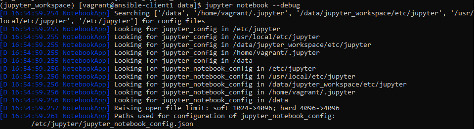
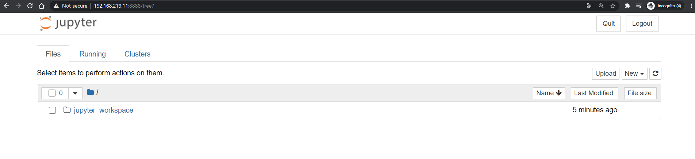

# 1. 프로젝트 개요
vagrant와 ansible로 jupyter notebook 설치

# 2. 준비
* virtualbox 설치
* vagrant 설치
  
# 3. 사용방법
* 네트워크는 NAT, INTERNET 총 2개로 구성
```sh
vagrant up
cd /data
. ./jupyter_workspace/bin/activate
(jupyter_workspace) jupyter notebook --ip [ip]
```






# 4. 설정 수정
## 4.1 클라이언트 수 추가
* vagranfile파일: N변수 수정
* install_ansible/add_hosts.yaml파일: client그룹에 IP추가
## 4.2 IP 수정(default: nat + bridge)
* ansible서버 IP: vagrantfile의 IP_MASTER변수 수정
* ansible클라이언트 IP: vagrantfile의 IP_CLIENT변수 수정
* ./install_ansible/add_hosts.yaml CLIENT IP 수정

# 5. 참고자료
* [1] 블로그-ansible구축: https://daddyprogrammer.org/post/7369/ansible-vagrant/
* [2] 공식문서-playbooks Intro: https://docs.ansible.com/ansible/latest/user_guide/playbooks_intro.html
* [3] 공식문서-playbooks example: https://github.com/ansible/ansible-examples
* [4] 블로그: gather_facts: https://ossian.tistory.com/98
* [5] 번역: https://github.com/mcchae/ansible_doc_ko/blob/master/Asible%20%EC%86%8C%EA%B0%9C.md
* [6] 블로그-default설명: https://blog.leocat.kr/notes/2018/02/11/ansible-default-value
* [7] github-ansible&jupyternotebook install project: https://github.com/huydhn/ansible-jupyter-notebook.git
* [8] 블로그-파일생성: https://www.mydailytutorials.com/ansible-create-files/

# 6. todo
* hosts파일 만들때 home directory변수 자동 설정
* bridge네트워크 인터페이스 적용시 기존에 있는 NAT제거 -> vagrant ssh 접속 때문에 못지우려나?