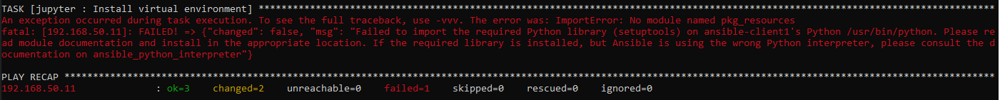

# 상황
 "ImportError: No module named pkg_resources" pip명령어 실행 불가

<br>



# 이유
* agent는 pip3를 실행하려고 했지만 ansible-server python-interpreter는 python2로 실행

<br>

# 해결
* 각 task를 실행할 때 vars로 python-interpreter을 python3로 실행
```yaml
- name: Install all Python packages
  pip:
    name: '{{ jupyter_notebook.python_packages }}'
    virtualenv: "{{ jupyter_notebook.virtualenv | default('/data/jupyter_workspace') }}"
    state: latest
  become_user: vagrant
  vars:
    ansible_python_interpreter: /usr/bin/python3
```

<br>

# 참고자료
* [1] stackoverflow: https://stackoverflow.com/questions/58450608/how-can-i-specify-the-version-of-python-to-use-in-an-ansible-playbook
* [2] 공식문서: https://docs.ansible.com/ansible/latest/reference_appendices/interpreter_discovery.html#interpreter-discovery
* [3] 공식문서-python interpreter 설명: https://docs.ansible.com/ansible/latest/installation_guide/intro_installation.html#installing-ansible-on-debian
* [4] 위키: http://wiki.pchero21.com/wiki/Ansible
